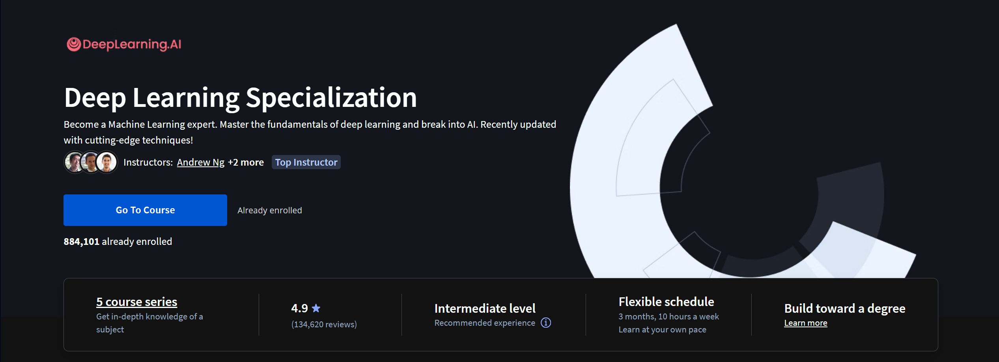

# Deep Learning Specialization

This repository contains information about the Deep Learning [specialization](https://www.coursera.org/specializations/deep-learning) offered by Coursera.

## Courses

[1. Neural Networks and Deep Learning](./course_1-neural-networks-deep-learning/)

[2. Improving Deep Neural Networks: Hyperparameter Tuning, Regularization and Optimization](./course_2-improving-deep-neural-networks/)

[3. Structuring Machine Learning Projects](./course_3-structuring-machine-learning-projects/)

[4. Convolutional Neural Networks](./course_4-convolutional-neural-networks/)

[5. Sequence Models](./course_5-sequence-models/)

## About the specialization

The Deep Learning Specialization is a foundational program that will help you understand the capabilities, challenges, and consequences of deep learning and prepare you to participate in the development of leading-edge AI technology. 

In this Specialization, you will build and train neural network architectures such as Convolutional Neural Networks, Recurrent Neural Networks, LSTMs, Transformers, and learn how to make them better with strategies such as Dropout, BatchNorm, Xavier/He initialization, and more. Get ready to master theoretical concepts and their industry applications using Python and TensorFlow and tackle real-world cases such as speech recognition, music synthesis, chatbots, machine translation, natural language processing, and more.

AI is transforming many industries. The Deep Learning Specialization provides a pathway for you to take the definitive step in the world of AI by helping you gain the knowledge and skills to level up your career. Along the way, you will also get career advice from deep learning experts from industry and academia.

### Applied Learning Project

By the end you’ll be able to:

#### Course 1

• Build and train deep neural networks, implement vectorized neural networks, identify architecture parameters, and apply DL to your applications

#### Course 2

• Use best practices to train and develop test sets and analyze bias/variance for building DL applications, use standard NN techniques, apply optimization algorithms, and implement a neural network in TensorFlow

#### Course 3

• Use strategies for reducing errors in ML systems, understand complex ML settings, and apply end-to-end, transfer, and multi-task learning

#### Course 4

• Build a Convolutional Neural Network, apply it to visual detection and recognition tasks, use neural style transfer to generate art, and apply these algorithms to image, video, and other 2D/3D data

#### Course 5

• Build and train Recurrent Neural Networks and its variants (GRUs, LSTMs), apply RNNs to character-level language modeling, work with NLP and Word Embeddings, and use HuggingFace tokenizers and transformers to perform Named Entity Recognition and Question Answering

## Professors

- [Andrew Ng: Instructor, Founder, DeepLearning.AI & Co-founder, Coursera](https://www.coursera.org/instructor/andrewng)
- [Kian Katanforoosh: Senior Curriculum Developer, DeepLearning.AI](https://www.coursera.org/instructor/kian-katanforoosh)
- [Younes Bensouda Mourri: Curriculum developer, DeepLearning.AI](https://www.coursera.org/instructor/younes)