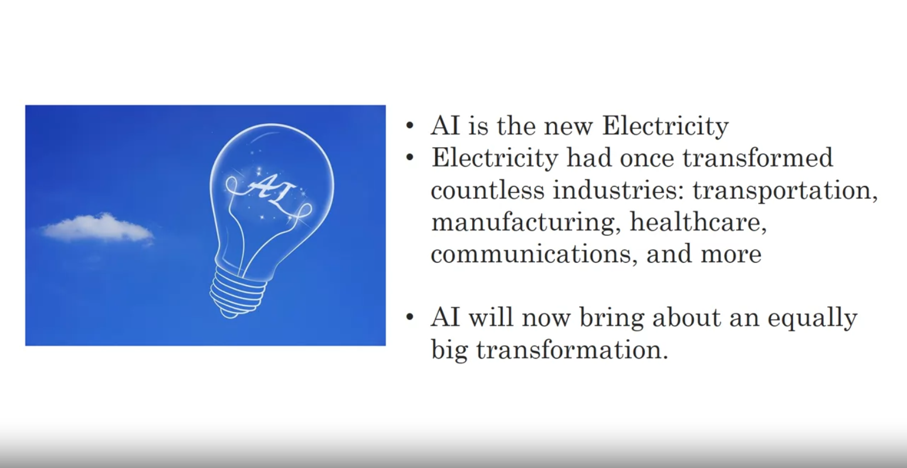
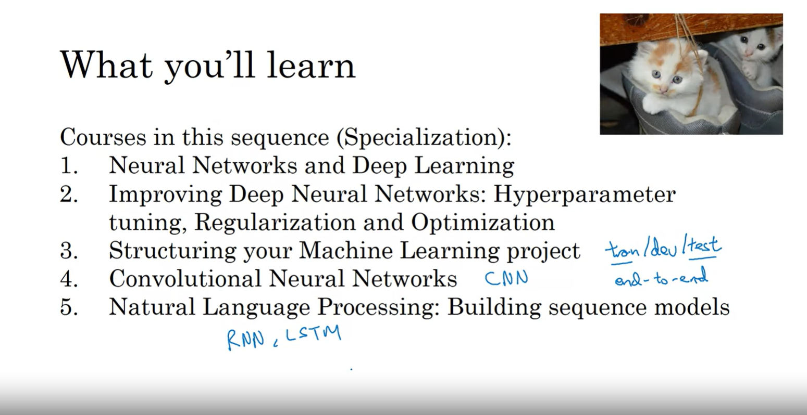

## Welcome

Hello and welcome. As you probably know, deep learning has already transformed traditional internet businesses like web search and advertising. But deep learning is also enabling brand new products and businesses and ways of helping people to be created. Everything ranging from better healthcare, where deep learning is getting really good at reading X-ray images to delivering personalized education, to precision agriculture, to even self driving cars and many others.

If you want to learn the tools of deep learning and be able to apply them to build these amazing things, I want to help you get there.

When you finish the sequence of courses on Coursera, called the specialization, you will be able to put deep learning onto your resume with confidence.

Over the next decade, I think all of us have an opportunity to build an amazing world, amazing society, that is AI-powered, and I hope that you will play a big role in the creation of this AI-powered society. So that, let's get started.

I think that AI is the new electricity. Starting about 100 years ago, the electrification of our society transformed every major industry, everything ranging from transportation, manufacturing, to healthcare, to communications and many more. And I think that today, we see a surprisingly clear path for AI to bring about an equally big transformation.

And of course, the part of AI that is rising rapidly and driving a lot of these developments, is deep learning. So today, deep learning is one of the most highly sought after skills in the technology world. And through this course, and a few courses after this one, I want to help you to gain and master those skills.

So here is what you will learn in this sequence of courses also called a specialization on Coursera.

### Course 1

In the first course, you will learn about the foundations of neural networks, you will learn about neural networks and deep learning. This video that you are watching is part of this first course, which last four weeks in total.

And each of the five courses in the specialization will be about two to four weeks, with most of them actually shorter than four weeks. But in this first course, you will learn how to build a neural network, including a deep neural network, and how to train it on data.

And at the end of this course, you will be able to build a deep neural network to recognize, guess what? Cats. For some reason, there is a cat meme running around in deep learning. And so, following tradition in this first course, we will build a cat recognizer.

### Course 2

Then in the second course, you will learn about the practical aspects of deep learning. So you will learn, now that you have built a neurak network, how to actually get it to perform well.

So you learn about hyperparameter tuning, regularization, how to diagnose bias and variance and advanced optimization algorithms like Momentum, RMSprop and the Adam optimization algorithm.

Sometimes it seems like there is a lot of tuning, even some black magic in how you build a new network. So the second course, which is just three weeks, will demystify some of that black magic.

### Course 3

In the third course, which is just two weeks, you will learn how to structure your machine learning project. It turns out that the strategy for building a machine learning system has changed in the era of deep learning.

So for example, the way you split your data into train, development or dev, also called holdout cross-validation sets and test sets, has changed in the era of deep learning.

So what are the new best practices for doing that? And whether if your training set and your test set come from different distributions? that is happening a lot more in the era of deep learning. So, how do you deal with that?

And if you have heard of end-to-end deep learning, you will also learn more about that in this third course, and see when you should use it and maybe when you shouldn't.

The material in this third course is relatively unique. I am going to share of you a lot of the hard-won lessons that I have learned, building and shipping quite a lot of deep learning products. As far as I know, this is largely material that is not taught in most universities that have deep learning courses. But I think it will really help you to get your deep learning systems to work well.

### Course 4

In the next course, we will then talk about convolutional neural networks, often abbreviated CNNs.

Convolutional networks, or convolutional neural networks, are often applied to images. So you will learn how to build these models in course four.

### Course 5

Finally, in course five, you will learn sequence models and how to apply them to natural language processing and other problems. So sequence models includes models like recurrent neural networks, abbreviated RNNs and LSTM models, stands for a long short term memory models.

You will learn what these terms mean in course five and be able to apply them to natural language processing problems. So you will learn these models in course five and be able to apply them to sequence data.

So for example, natural language is just a sequence of words, and you will also understand how these models can be applied to speech recognition or to music generation and other problems.

### Summary

So through these courses, you will learn the tools of deep learning, you will be able to apply them to build amazing things, and I hope many of you through this will also be able to advance your career. So with that, let's get started. Please go on to the next video where we will talk about deep learning applied to supervised learning
