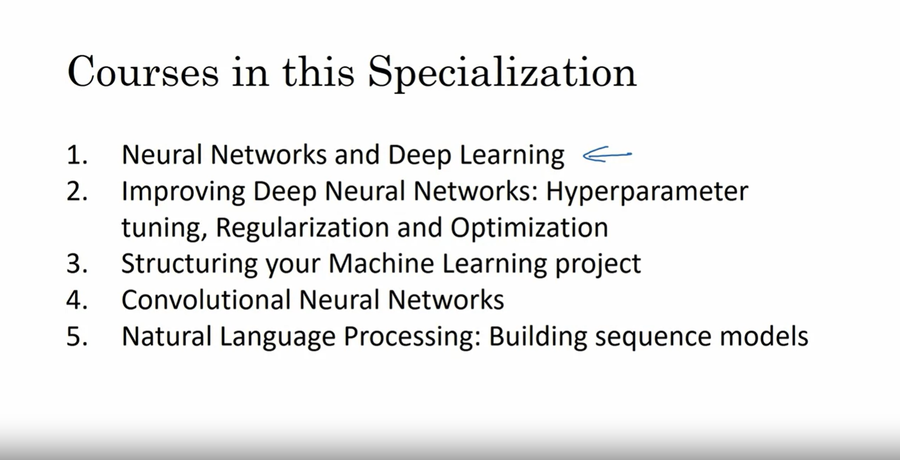

## What is a Neural Network?

The term Deep Learning refers to training Neural Networks, sometimes very large Neural Networks. So what exactly is a Neural Network? In this video, let's try to give you some of the basic intuitions.

Let's start with a Housing Price Prediction example. Let's say you have a data set with six houses, so you know the size of the houses in square feet or square meters and you know the price of the house and you want to fit a function to predict the price of a house as a function of its size

So if you are familiar with linear regression you might say, well let's put a straight line to this data, so and we get a straight line like that but to be put fancier, you might say, well we know that prices can never be negative, right? So instead of the straight line fit, which eventually will become negative, let's bend the curve here. So it just ends up zero here. So this thick blue line ends up being your function for predicting the price of the house as a function of its size where it is zero here and then there is a straight line fit to the right.

So you can think of this function that you have just fit to housing prices as a very simple neural network. It is almost the simplest possible neural network. Let me draw it here.

We have as the input to the neural network the size of a house which we call $x$. It goes into this node, this little circle and then it outputs the price which we call $y$. So this little circle, which is a single neuron in a neural network, implements this function that we drew on the left.

And all that the neuron does is it inputs the size, computes this linear function, takes a max of zero and then outputs the estimated price.

And by the way in the neural network literature, you will see this function a lot. This function which goes to zero sometimes and then it'll take of as a straight line. This function is called a ReLU function which stands for Rectified Linear Units and rectify just means taking a max of 0 which is why you get a function shape like this.

You don't need to worry about ReLU units for now but it's just something you will see again later in this course. So if this is a single neuron, neural network, really a tiny little neural network, a larger neural network is then formed by taking many of the single neurons and stacking them together. So, if you think of this neuron that's being like a single Lego brick, you then get a bigger neural network by stacking together many of these Lego bricks. Let's see an example.

Let’s say that instead of predicting the price of a house just from the size, you now have other features, you know other things about the house, such as the number of bedrooms, which we would write as "#bedrooms" and you might think that one of the things that really affects the price of a house is family size, right? 

So can this house fit your family of three, or family of four, or family of five? And it's really based on the size in square feet or square meters and the number of bedrooms that determines whether or not a house can fit your family's family size. 

And then maybe you know the zip codes, in different countries it's called a postal code of a house and the zip code maybe as a feature tells you, walkability. So is this neighborhood highly walkable? Think just walks to the grocery store? Walk to school? Do you need to drive? And some people prefer highly walkable neighborhoods. 

And then the zip code as well as the wealth maybe tells you, certainly in the United States but some other countries as well, tells you how good is the school quality. 

So each of these little circles I'm drawing, can be one of those ReLU, rectified linear units or some other slightly non linear function. So that based on the size and number of bedrooms, you can estimate the family size, their zip code, based on walkability, based on zip code and wealth can estimate the school quality. 

And then finally you might think that well the way people decide how much they're willing to pay for a house, is they look at the things that really matter to them. In this case family size, walkability and school quality and that helps you predict the price.

So in the example $x$ is all of these four inputs and $y$ is the price you're trying to predict.

And so by stacking together a few of the single neurons or the simple predictors we have from the previous slide, we now have a slightly larger neural network. 

How you manage neural network is that when you implement it, you need to give it just the input $x$ and the output $y$ for a number of examples in your training set and all these things in the middle, they will figure out by itself?

So what you actually implement is this. 

Where, here, you have a neural network with four inputs. So the input features might be the size, the number of bedrooms, the zip code or postal code and the wealth of the neighborhood. 

And so given these input features, the job of the neural network will be to predict the price $y$.

And notice also that each of these circles, these are called hidden units in the neural network, that each of them takes its inputs all four input features. 

So for example, rather than saying this first node represents family size and family size depends only on the features $x_1$ and $x_2$, instead, we're going to say, well neural network, you decide whatever you want this node to be and we'll give you all four input features to compute whatever you want. 

So we say that layer that this is input layer and this layer in the middle of the neural network are densely connected because every input feature is connected to every one of these circles in the middle. 

And the remarkable thing about neural networks is that, given enough data about $x$ and $y$, given enough training examples with both $x$ and $y$, neural networks are remarkably good at figuring out functions that accurately map from $x$ to $y$.

### Summary

So, that's a basic neural network. It turns out that as you build out your own neural networks, you'll probably find them to be most useful, most powerful in Supervised Learning settings meaning that you're trying to take an input $x$ and map it to some output $y$, like we just saw in the housing price prediction example. 

In the next video let's go over some more examples of Supervised Learning and some examples of where you might find your networks to be incredibly helpful for your applications as well.

Quick question:

True or false? As explained in this lecture, every input layer feature is interconnected with every hidden layer feature. Answer: True

## Supervised Learning with Neural Networks

There's been a lot of hype about neural networks and perhaps some of that hype is justified given how well they're working but it turns out that so far, almost all the economic value created by neural networks has been through one type of machine learning called Supervised Learning. Let's see what that means and let's go over some examples. 

In Supervised Learning, you have some input $x$ and you want to learn a function mapping to some output $y$. 

### Example 1: House prediction based on home features

So for example, just now we saw the housing price prediction application where you input some features of a home and try to output or estimate the price $y$. 

Here are some other examples that neural networks have been applied to very effectively. 

### Example 2: Online advertising

Possibly the single most lucrative application of deep learning today is online advertising, maybe not the most inspiring, but certainly very lucrative, in which, by inputting information about an ad to the website it's thinking of showing you and some information about the user, neural networks have gotten very good at predicting whether or not you click on an ad and by showing you and showing users the ads that you are most likely to click on, this has been an incredibly lucrative application of neural networks at multiple companies because the ability to show you ads that you're more likely to click on has a direct impact on the bottom line of some of the very large online advertising companies.

### Example 3: Image. Computer Vision

Computer vision has also made huge strides in the last several years, mostly due to deep learning. So you might input an image and want to output an index, say from 1 to 1,000 trying to tell you if this picture, it might be any one of, say a 1000 different images. 

So, you might us that for photo tagging. 

### Example 4: Audio. Speech recognition

I think the recent progress in speech recognition has also been very exciting, where you can now input an audio clip to a neural network and have it output a text transcript. 

### Example 5: Machine transcript

Machine translation has also made huge strides thanks to deep learning where now you can have a neural network input an English sentence and directly output say, a Chinese sentence

### Example 5: Image, Radar info. Autonomous driving

And in autonomous driving, you might input an image, say a picture of what's in front of your car as well as some information from a radar and based on that, maybe a neural network can be trained to tell you the position of the other cars on the road so this becomes a key component in autonomous driving systems. 

#### Importance of cleverly select $x$ and $y$

So a lot of the value creation through neural networks has been through cleverly selecting what should be $x$ and what should be $y$ for your particular problem and then fitting this Supervised Learning component into often a bigger system such as an autonomous vehicle. 

### Different types of Neural network architectures

It turns out that slightly different types of neural networks are useful for different applications. 

#### Standard Neural network (SNN)

For example, in the real estate application that we saw in the previous video, we used a universally standard neural network architecture. Maybe for real estate and online advertising might be a relatively standard neural network, like the one that we saw.

#### Convolutional Neural network (CNN)

For image applications, we'll often use convolutional neural networks, often abbreviated CNN.

#### Recurrent Neural network (RNN)

And for sequence data, so for example, audio has a temporal component. Audio is played out over time, so audio is most naturally represented as a one-dimensional time series or as a one-dimensional temporal sequence and so for sequence data, you often use an RNN, a recurrent neural network.

Also, language, English and Chinese, the alphabets or the words come one at a time, so language is also most naturally represented as sequence data and so more complex versions of RNNs are often used for these applications

#### Custom/hybrid Neural network

And then, for more complex applications, like autonomous driving, where you have an image, that might suggest more of a CNN, convolution neural network, structure and radar info which is something quite different, you might end up with a more custom, or some more complex, hybrid neural network architecture.

### Neural network examples

So, just to be a bit more concrete about what are the standard NN, CNN and RNN architectures

So, in the literature you might have seen pictures like the one on the left. So, that's a standard neural net. 

You might have seen pictures like the one in the middle. Well, this is an example of a Convolutional Neural Network and we'll see in a later course exactly what this picture means and how can you implement this but convolutional networks are often used for image data and you might also have seen pictures like this and you'll learn how to implement this in a later course, recurrent neural networks, are very good for this type of one-dimensional sequence data that has maybe a temporal component.

### Structured and Unstructured data

You might also have heard about applications of machine learning to both Structured Data and Unstructured Data. Here's what the terms mean. 

#### Structured data

Structured Data means basically databases of data. So, for example, in housing price prediction, you might have a database or the column that tells you the size and the number of bedrooms. So, this is structured data.

Or in predicting whether or not a user will click on an ad, you might have information about the user, such as the age, some information about the ad and then labels $y$ that you're trying to predict. So, that's structured data, meaning that each of the features, such as size of the house, the number of bedrooms, or the age of a user, has a very well defined meaning. 

#### Unstructured data

In contrast, Unstructured data refers to things like audio, raw audio, or images where you might want to recognize what's in the image or text. 

Here, the features might be the pixel values in an image or the individual words in a piece of text. 

Historically, it has been much harder for computers to make sense of unstructured data compared to structured data and in fact the human race has evolved to be very good at understanding audio cues as well as images and then text was a more recent invention, but people are just really good at interpreting unstructured data and so one of the most exciting things about the rise of neural networks is that, thanks to deep learning, thanks to neural networks, computers are now much better at interpreting unstructured data as well compared to just a few years ago and this creates opportunities for many new exciting applications that use speech recognition, image recognition, natural language processing on text, much more than was possible even just two or three years ago. 

I think because people have a natural empathy to understanding unstructured data, you might hear about neural network successes on unstructured data more in the media because it's just cool when a neural network recognizes a cat. We all like that and we all know what that means.

But it turns out that a lot of short term economic value that neural networks are creating has also been on structured data, such as much better advertising systems, much better profit recommendations and just a much better ability to process the giant databases that many companies have to make accurate predictions from them. 

So, in this course, a lot of the techniques we'll go over will apply to both structured data and to unstructured data. For the purposes of explaining the algorithms, we will draw a little bit more on examples that use unstructured data but as you think through applications of neural networks within your own team I hope you find both uses for them in both structured and unstructured data

### Summary

So, neural networks have transformed Supervised Learning and are creating tremendous economic value. It turns out though, that the basic technical ideas behind neural networks have mostly been around, sometimes for many decades. 

So, why is it, then, that they're only just now taking off and working so well? 

In the next video, we'll talk about why it's only quite recently that neural networks have become this incredibly powerful tool that you can use.

Quick question:

Would structured or unstructured data have features such as pixel values or individual words? Answer: Unstructured data

## Why is Deep Learning taking off?

If the basic technical ideas behind deep learning/behind your networks have been around for decades, why are they only just now taking off? 

In this video, let's go over some of the main drivers behind the rise of deep learning because I think this will help you better spot the best opportunities within your own organization to apply these to.

Over the last few years a lot of people have asked me "Andrew why is deep learning suddenly working so well?" and when I am asked that question this is usually the picture I draw for them. 

Let's say we plot a figure where on the horizontal axis we plot the amount of data we have for a task and let's say on the vertical axis we plot the performance on involved learning algorithms such as the accuracy of our spam classifier or our ad click predictor or the accuracy of our neural net for figuring out the position of other cars for our self-driving car. 

### Red curve: Traditional Learning algorithms (SVM, Logistic Regression, ...)

It turns out if you plot the performance of a traditional learning algorithm like support vector machine or logistic regression as a function of the amount of data you have you might get a curve that looks like this (red curve) where the performance improves for a while as you add more data but after a while the performance pretty much plateaus, suppose your horizontal lines enjoy that very well you know was it they didn't know what to do with huge amounts of data.

### Digitalization of a society

And what happened in our society over the last 20 years maybe is that for a lot of problems we went from having a relatively small amount of data to having you know often a fairly large amount of data and all of this was thanks to the digitization of a society where so much human activity is now in the digital realm we spend so much time on the computers, on websites, on mobile apps and activities on digital devices creates data and thanks to the rise of inexpensive cameras built into our cell phones, accelerometers, all sorts of sensors in the Internet of Things, we also just have been collecting one more and more data. 

So, over the last 20 years for a lot of applications we just accumulate a lot more data, more than traditional learning algorithms were able to effectively take advantage of. 

### Yellow curve: Small NN

And what neural network lead turns out that if you train a small neural net then this performance maybe looks like that (yellow curve). 

### Blue curve: Medium NN

If you train a somewhat larger NN, that's called as a medium-sized neural net, performance often even look a little bit better

### Green NN: Large NN

And if you train a very large neural net, then its performance often just keeps getting better and better. 

So, a couple observations: One is if you want to hit this very high level of performance, then you need two things:

1. Often, you need to be able to train a big enough neural network in order to take advantage of the huge amount of data
   
2. You need to be out here (right most black arrow on horizontal axis), on the x axis you do need a lot of data so we often say that scale has been driving deep learning progress and by scale I mean both the size of the neural network, meaning just a neural network with a lot of hidden units, a lot of parameters, a lot of connections, as well as the scale of the data. 

In fact, today one of the most reliable ways to get better performance in a neural network is often to either train a bigger network or throw more data at it and that only works up to a point because eventually you run out of data or eventually then your network is so big that it takes too long to train but just improving scale has actually taken us a long way in the world of deep learning

In order to make this diagram a bit more technically precise, let me just add a few more things:

- I wrote the amount of data on the x-axis: Technically, this is amount of **labeled** data where by labeled data I mean training examples we have both the input $x$ and the label $y$: This is $(x, y)$
  
- I went to introduce a little bit of notation that we'll use later in this course, we're going to use lowercase alphabet $m$ to denote the size of my training sets or the number of training examples this lowercase $m$ so that's the horizontal axis. 
  
- A couple other details to this figure, in this regime of smaller training sets, the relative ordering of the algorithms is actually not very well defined. So, if you don't have a lot of training data it is often up to your skill at hand engineering features that determines performance so it's quite possible that if someone training an SVM is more motivated to hand engineer features and someone training even larger neural nets, that may be in this small training set regime, the SVM could do better so you know in this region to the left of the figure the relative ordering between the algorithms is not that well defined and performance depends much more on your skill at hand engineer features and other lower details of the algorithms
  
- And there's only in this big data regime, very large training sets, very large $m$ regime in the right, that we more consistently see large neural nets dominating the other approaches. 

And so if any of your friends ask you why are neural nets taking off I would encourage you to draw this picture for them as well

### Scale drives deep learning progress

So, I will say that in the early days in their modern rise of deep learning, it was scaled data and scale of computation just our ability to train very large neural networks either on a CPU or GPU that enabled us to make a lot of progress. 

But increasingly, especially in the last several years, we've seen tremendous algorithmic innovation as well so I also don't want to understate that. 

Interestingly, many of the algorithmic innovations have been about trying to make neural networks run much faster. So, as a concrete example one of the huge breakthroughs in neural networks has been switching from a sigmoid function, which looks like this, to a ReLU function, which we talked about briefly in an early video, that looks like this.

If you don't understand the details of one about the state don't worry about it but it turns out that one of the problems of using sigmoid functions in machine learning is that there are these regions here where the slope of the function where the gradient is nearly zero and so learning becomes really slow, because when you implement gradient descent and gradient is zero the parameters just change very slowly and so learning is very slow whereas by changing the what's called the activation function the neural network to use this function called the ReLU function (the REctified Linear Unit), the gradient is equal to 1 for all positive values of input

And so, the gradient is much less likely to gradually shrink to 0 and the gradient here, the slope of this line is 0 on the left but it turns out that just by switching from the sigmoid function, to the RELU function has made an algorithm called gradient descent work much faster and so this is an example of maybe relatively simple algorithmic innovation but ultimately, the impact of this algorithmic innovation was it really helped computation. 

So, there are actually quite a lot of examples like this of where we change the algorithm because it allows that code to run much faster and this allows us to train bigger neural networks, or to do so the reason will decline even when we have a large network along all the data. 

The other reason that fast computation is important is that it turns out the process of training your network is very intuitive: Often, you have an idea for a neural network architecture and so you implement your idea in code, implementing your idea then lets you run an experiment which tells you how well your neural network does and then by looking at it you go back to change the details of your neural network and then you go around this circle over and over.

And when your neural network takes a long time to train, it just takes a long time to go around this cycle and there's a huge difference in your productivity building effective neural networks when you can have an idea and try it and see the work in ten minutes or maybe at most a day, versus if you've to train your neural network for a month, which sometimes does happen, because when you get a result back in ten minutes or maybe in a day you can just try a lot more ideas and be much more likely to discover a neural network that works well for your application

And so faster computation has really helped in terms of speeding up the rate at which you can get an experimental result back and this has really helped both practitioners of neural networks as well as researchers working in deep learning iterate much faster and improve your ideas much faster. 

So, all this has also been a huge boon to the entire deep learning research community which has been incredible just inventing new algorithms and making nonstop progress on that front

### Summary

So, these are some of the forces powering the rise of deep learning but the good news is that these forces are still working powerfully to make deep learning even better. 

Take data: society is still throwing out more digital data or take computation with the rise of specialized hardware like GPUs and faster networking, many types of hardware, I'm actually quite confident that our ability to build very large neural networks from a computation point of view will keep on getting better and take algorithms: relative to deep learning research communities are continuously phenomenal at innovating on the algorithms front. 

So, because of this, I think that we can be optimistic answer is that deep learning will keep on getting better for many years to come. 

So, with that, let's go on to the last video of the section where we'll talk a little bit more about what you will learn from this course.

Quick question:

What will the variable $m$ denote in this course?
- Number of hidden layers
- Number of training examples (Right answer)
- The expected output
- Slope

## About this Course

So you're just about to reach the end of the first week of material on the first course in this specialization. 

Let me give you a quick sense of what you'll learn in the next few weeks as well.

As I said in the first video, this specialization comprises five courses and right now, we're in the first of these five courses, which teaches you the most important foundations, really the most important building blocks of deep learning. 

So, by the end of this first course, you will know how to build and get to work a deep neural network

### Outline of this course

So, here the details of what is in this first course.

#### Week 1

This course is four weeks of material and you're just coming up to the end of the first week when you saw an introduction to deep learning. 

At the end of each week, there are also be 10 multiple-choice questions that you can use to double check your understanding of the material. 

So, when you're done watching this video, I hope you're going to take a look at those questions. 

#### Week 2

In the second week, you will then learn about the Basics of Neural Network Programming. You'll learn the structure of what we call the forward propagation and the back propagation steps of the algorithm and how to implement neural networks efficiently. 

Starting from the second week, you also get to do a programming exercise that lets you practice the material you've just learned, implement the algorithms yourself and see it work for yourself. 

I find it really satisfying when I learn about algorithm and I get it coded up and I see it worked for myself. So I hope you enjoy that too. 

#### Week 3

Having learned the framework for neural network programming, in the third week, you will code up a single hidden layer neural network. So, you will learn about all the key concepts needed to implement and get to work a neural network. 

#### Week 4

And then finally in week four, you will build a deep neural network, a neural network with many layers and see it work for yourself. 

### Summary

So, congratulations on finishing the videos up to this one. 

I hope that you now have a good high-level sense of what's happening in deep learning. And perhaps some of you are also excited to have some ideas of where you might want to apply deep learning yourself. 

So, I hope that after this video, you go on to take a look at the 10 multiple choice questions that follow this video on the course website and just use the 10 multiple choice questions to check your understanding. 

And don't worry if you don't get all the answers right the first time, you can try again and again until you get them all right. I found them useful to make sure that I'm understanding all the concepts, I hope you're that way too. 

So with that, congrats again for getting up to here and I look forward to seeing you in the week two videos

## Intake Survey

We would love to learn more about your experience with DeepLearning.AI and with AI in general. Please consider completing this short 3-question survey so we can better serve you!

This course uses a third-party app, Intake Survey, to enhance your learning experience. The app will reference basic information like your name, email, and Coursera ID.

## [IMPORTANT] Have questions, issues or ideas? Join our Forum!

Hey Learner!

Excited about this course? Join our Forum to:

- Chat with others: Share ideas, ask questions, and discuss AI.
- Work together: Collaborate on AI projects and build something awesome.
- Stay in the loop: Get updates on courses, events, and AI news.

Click on [this link](https://community.deeplearning.ai/?utm_campaign=forum-engagement&utm_medium=long-form-courses&utm_source=coursera) to create your free account and connect with the global AI community!

The DeepLearning.AI team

## Frequently Asked Questions

Congratulations to be part of the first class of the Deep Learning Specialization! This form is here to help you find the answers to the commonly asked questions. We will update it as we receive new questions that we think are important for all learners.

### General Questions

Q: I have an idea that would improve the course content. What can I do? 

A: You can put it in Discourse as "New ideas for the course". Our staff or mentors will take notice. Thanks a lot.

#

Q: The audio in the videos is quite bad sometimes, muffled or low volume. Please fix it. 

A: You can mitigate the audio issues by turning down the bass and up the treble if you have those controls, or using a headset, which naturally emphasizes the higher frequencies. Also you may want to switch on the English closed captioning. Of course, we are working everyday to improve the quality of the videos and avoid anything that can affect your learning.

#

Q: What does it mean when I see “Math Processing Error?” 

A: The page is attempting to use MathJax to render math symbols. Sometimes the content delivery network can be sluggish or you have caught the web page Ajax javascript code in an incomplete state. Normally, just refreshing the page to make it load fully fixes the problem.

#

Q: The video quality is bad? 

A: You could click the settings option in the video and upgrade the quality to High. (recommoended if you have a good internet cnnection)

#

Q: Is there a prerequisite for this course? 

A: Students are expected to have the following background:

- Very basic programming skills (i.e. ability to  import libraries,  create variables, functions, lists, dictionaries and for loops)

- Familiarity with basic machine learning (how do we represent a dataset as a matrix, etc.).

- Familiarity with the basic linear algebra (matrix multiplications, vector operations etc.).

#

Q: Why do we have to use Python? 

A: Python is an open-source language, anyone can use it from anywhere in the world. It is widely used in academics (research labs) or in the industry. It has a useful library "Numpy" that makes math operations very easy. Python has several deep learning frameworks running on top of it (Tensorflow, Keras, PaddlePaddle, CNTK, Caffe, ...) and you are going to learn some of them. It is also easy to learn. Furthermore, we believe Python has a good future, as the community is really active and builds amazing stuff. 

#

Q: Has anyone figured out the how to solve this problem? Here is my code [Insert code]. 

A: This is a violation of the Coursera Honor Code. 

#

Q: I've submitted correct answers for [insert problem]. However I would like to compare my implementation with other who did correctly. 

A: This is a violation of the Coursera Honor Code. 

#

Q: This is my email: [insert email]. Can we get the answer for the quiz? 

A: This is a violation of the Coursera Honor Code.

#

Q: Do I receive a certificate once I complete this course? 

A: Course Certificate is available in this course.

#

Q: What is the correct technique of entering a numeric answer to a text box question ? 

A: Coursera's software for numeric answers only supports '.' as the decimal delimiter (not ',') and require that fractions be simplified to decimals. For answers with many decimal digits, please use a 2 digits after decimal point rounding method when entering solutions if not mentioned in the question.

#

Q: What is the correct technique of entering a 1 element matrix ? 

A: They should be entered as just the element without brackets.

#

Q: What does a A being a 3 element vector or a 3 dimensional vector mean? 

A: If not described, a vector as mentioned in the question is 

$$
A = \begin{bmatrix}
\text{element1} \\
\text{element2} \\
\text{element3}
\end{bmatrix}
$$

#

Q: I think I found an error in a video. What should I do? 

A: Post it in Discourse. We will try to implement your feedback as soon as possible.

#

Q: My quiz grade displayed is wrong or I have a verification issue or I cannot retake a quiz. What should I do? 

A: Contact learner support. These queries can only be resolved by learner support and it is best if they are contacted directly. Do not flag such issues.

#
