## Binary Classification

Hello, and welcome back. In this week we're going to go over the basics of neural network programming. It turns out that when you implement a neural network there are some techniques that are going to be really important.

For example, if you have a training set of $m$ training examples, you might be use to processing the training set by having a for loop step through your $m$ training examples but it turns out that when you're implementing a neural network, you usually want to process your entire training set without using an explicit for loop to loop over your entire training set. So, you'll see how to do that in this week's materials.

Another idea: when you organize the computation of a neural network, usually you have what's called a forward pass or forward propagation step, followed by a backward pass or what's called a backward propagation step and so in this week's materials, you also get an intuition about why the computations in learning/in a neural network can be organized in this forward propagation and a separate backward propagation.

For this week's materials, I want to convey these ideas using Logistic Regression in order to make the ideas easier to understand but even if you've seen Logistic Regression before, I think that there'll be some new and interesting ideas for you to pick up in this week's materials.

So with that, let's get started.

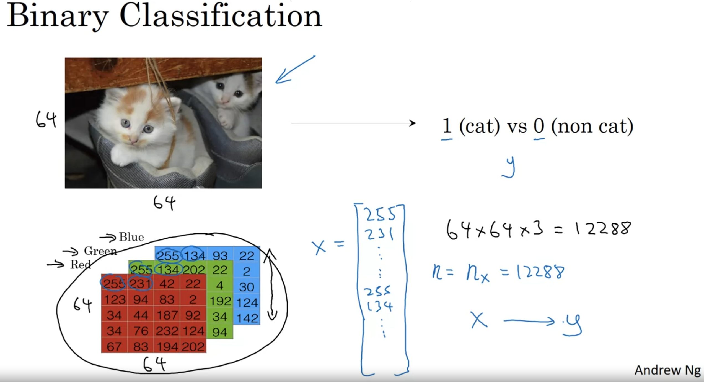

Logistic Regression is an algorithm for binary classification. So let's start by setting up the problem.

Here's an example of a binary classification problem. You might have an input of an image, like that, and want to output a label to recognize this image as either being a cat, in which case you output 1, or not-cat in which case you output 0, and we're going to use $y$ to denote the output label.

Let's look at how an image is represented in a computer. To store an image your computer stores three separate matrices corresponding to the red, green, and blue color channels of this image.

So, if your input image is 64 pixels by 64 pixels, then you would have 3 times 64 by 64 matrices corresponding to the red, green and blue pixel intensity values for your images.

Although to make this little slide I drew these as much smaller matrices, so these are actually 5 by 4 matrices rather than 64 by 64.

So, to turn these pixel intensity values into a feature vector, what we're going to do is unroll all of these pixel values into an input feature vector $x$.

So, to unroll all these pixel intensity values into a feature vector, what we're going to do is define a feature vector $x$ corresponding to this image as follows: We're just going to take all the pixel values 255, 231, and so on. 255, 231, and so on until we've listed all the red pixels and then eventually 255,134, 255, 134 and so on until we get a long feature vector listing out all the red, green and blue pixel intensity values of this image.

If this image is a 64 by 64 image, the total dimension of this vector $x$ will be 64 by 64 by 3 because that's the total numbers we have in all of these matrixes which in this case, turns out to be 12,288, that's what you get if you multiply all those numbers.

And so we're going to use $n_x=12288$ to represent the dimension of the input features $x$ and sometimes for brevity, I will also just use lowercase $n$ to represent the dimension of this input feature vector.

So, in binary classification, our goal is to learn a classifier that can input an image represented by this feature vector $x$ and predict whether the corresponding label $y$ is 1 or 0, that is, whether this is a cat image or a non-cat image.

### Notation

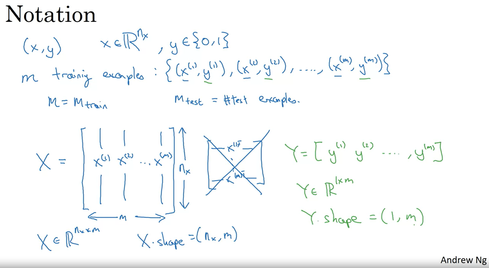

Let's now lay out some of the notation that we'll use throughout the rest of this course.

A single training example is represented by a pair, $(x,y)$ where $x$ is an x-dimensional feature vector and $y$, the label, is either 0 or 1.

Your training set will comprise lower-case $m$ training examples and so your training set will be written $(x^{(1)}, y^{(1)})$ which is the input and output for your first training example $(x^{(2)}, y^{(2)})$ for the second training example up to $(x^{(m)}, y^{(m)})$ which is your last training example and then that altogether is your entire training set.

So, I'm going to use lowercase $m$ to denote the number of training samples and sometimes to emphasize that this is the number of train examples, I might write this as $m=m_{train}$ and when we talk about a test set, we might sometimes use $m_{test}$ to denote the number of test examples so that's the number of test examples.

Finally, to output all of the training examples into a more compact notation, we're going to define a matrix capital $X$ as defined by taking you training set inputs $x^{(1)}$, $x^{(2)}$ and so on and stacking them in columns.

So, we take $x^{(1)}$ and put that as a first column of this matrix, $x^{(2)}$, put that as a second column and so on down to $x^{(m)}$, then this is the matrix capital $X$.

So, this matrix $X$ will have $m$ columns, where $m$ is the number of training examples and the number of rows or the height of this matrix is $n_x$.

Notice that in other courses, you might see the matrix capital $X$ defined by stacking up the train examples in rows like so, X1 transpose down to Xm transpose but it turns out that when you're implementing neural networks using this convention I have on the left, will make the implementation much easier.

So, just to recap, $X$ is a $n_x$ by $m$ dimensional matrix, and when you implement this in Python, you see that X.shape, that's the python command for finding the shape of the matrix, that this an nx, m. That just means it is an nx by $m$ dimensional matrix.

So, that's how you group the training examples input x into matrix.

How about the output labels $y$? It turns out that to make your implementation of a neural network easier, it would be convenient to also stack $y$ in columns so we're going to define capital $Y$ to be equal to $y^{(1)}$, $y^{(2)}$, up to $y^{(m)}$ like so.

So, $Y$ here will be a 1 by $m$ dimensional matrix and again, to use the python notation, the shape of $Y$ will be 1, m which just means this is a 1 by $m$ matrix and as you implement your neural network later in this course you'll find that a useful convention would be to take the data associated with different training examples and by data I mean either x or y, or other quantities you see later but to take the stuff or the data associated with different training examples and to stack them in different columns, like we've done here for both $X$ and $Y$

### Summary

So, that's a notation we'll use for a Logistic Regression and for neural networks networks later in this course. If you ever forget what a piece of notation means, like what is $m$ or what is $n$ or what is something else, we've also posted on the course website a notation guide that you can use to quickly look up what any particular piece of notation means. So with that, let's go on to the next video where we'll start to fetch out Logistic Regression using this notation.

## Logistic Regression

In this video, we'll go over Logistic Regression. This is a learning algorithm that you use when the output labels $y$ in a supervised learning problem are all either zero or one, so for binary classification problems.

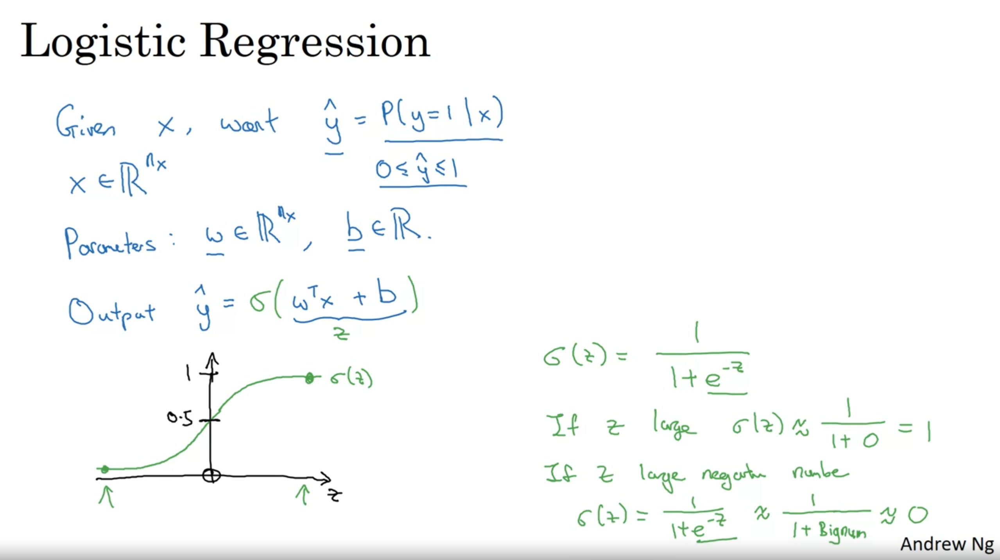

Given an input feature vector $x$ maybe corresponding to an image that you want to recognize as either a cat picture or not a cat picture, you want an algorithm that can output a prediction, which we'll call $\hat{y}$, which is your estimate of $y$.

More formally, you want $\hat{y}$ to be the probability or the chance that, $y=1$ given the input features $x$:

$$
\hat{y} = P(y=1 | x)
$$

So, in other words, if $x$ is a picture, as we saw in the last video, you want $\hat{y}$ to tell you, what is the chance that this is a cat picture.

So, $x$, as we said in the previous video, is $n_x$ dimensional vector.

$$
x \in \mathbb{R}^{n_x}
$$

Given that the parameters of Logistic Regression will be $w$ which is also an $n_x$ dimensional vector:

$$
w \in \mathbb{R}^{n_x}
$$

together with $b$ which is just a real number:

$$
b \in \mathbb{R}
$$

### How can we generate the output $\hat{y}$?

So, given an input $x$ and the parameters $w$ and $b$, how do we generate the output $\hat{y}$?

#### Incorrect approach to generate $\hat{y}$

Well, one thing you could try, that doesn't work, would be to have

$$
\hat{y} = w^{T}x + b
$$

kind of a linear function of the input $x$. And in fact, this is what you use if you were doing linear regression.

But this isn't a very good algorithm for binary classification because you want $\hat{y}$ to be the chance that $y=1$

So, $\hat{y}$ should really be between zero and one:

$$
0 \leq \hat{y} \leq 1
$$

and it's difficult to enforce that because

$$
w^{T}x + b $$ 

can be much bigger than one or it can even be negative, which doesn't make sense for probability that you want it to be between zero and one. 

#### Correct approach to generate $\hat{y}$

So, in Logistic Regression, our output is instead going to be 

$$ \hat{y} = \sigma(w^{T}x + b) $$ 

where $\sigma$ is called the sigmoid function.

This is what the sigmoid function looks like: 

If on the horizontal axis I plot $z$, then the function $\sigma(z)$ looks like this. So, it goes smoothly from zero up to one. 

Let me label my axes here, this is zero and it crosses the vertical axis as 0.5. So, this is what $\sigma(z)$ looks like. 

And we're going to use $z$ to denote this quantity: 

$$ z = w^{T}x + b
$$

Here's the formula for the sigmoid function:

$$
\sigma(z) = \frac{1}{1 + e^{-z}}
$$

where $z$ is a real number

So, notice a couple of things.

- If $z$ is very large, then $e^{-z}$ will be close to zero. So, then $\sigma(z)$ will be approximately one over one plus something very close to zero, because e to the negative of a very large number will be close to zero. So, this is close to 1.
  And indeed, if you look in the plot on the left, if $z$ is very large, then the $\sigma(z)$ is very close to 1.

If $z$ is very large, then:

$$
\sigma(z) = \frac{1}{1 + e^{-z}} $$ 

$$ \sigma(oo) = \frac{1}{1 + e^{-oo}} = \frac{1}{1 + 0} \approx 1
$$

- Conversely, if $z$ is very small, or it is a very large negative number, then $\sigma(z)$ becomes one over one plus e to the negative Z, and this becomes a huge number. So, this becomes, think of it as one over one plus a number that is very, very big, and so, that's close to zero.
  And indeed, you see that as $z$ becomes a very large negative number, $\sigma(z)$ goes very close to 0.

If $z$ is very small, then:

$$
\sigma(z) = \frac{1}{1 + e^{-z}}
$$

$$
\sigma(0.000001) = \frac{1}{1 + e^{-0.000001}} = \frac{1}{1 + oo} \approx 0
$$

So, when you implement Logistic Regression, your job is to try to learn parameters $w$ and $b$ so that $\hat{y}$ becomes a good estimate of the chance of $y=1$

### Other Notation: $\theta$

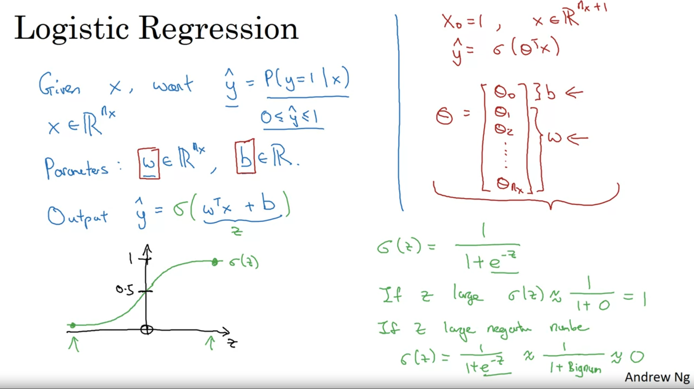

Before moving on, let's discuss an alternative notation that you might encounter in other courses.

When we program neural networks, we usually keep the parameter $w$ and parameter $b$ separate, where $b$ corresponds to an intercept term.

In some other courses, you might have seen a different notation that handles this differently. In these conventions, you define an extra feature called $x_0 = 1$, so that:

$$x \in \mathbb{R}^{n_x + 1}$$

And then you define:

$$\hat{y} = \sigma(\theta^T x)$$

In this alternative notation, you have vector parameters $\theta$: $\theta_0$, $\theta_1$, $\theta_2$, down to $\theta_{n_x}$

Where:
- $\theta_0$ plays the role of $b$ (a real number)
- $\theta_1$ through $\theta_{n_x}$ play the role of $w$

It turns out that when you implement your neural network, it will be easier to just keep $b$ and $w$ as separate parameters. Therefore, in this course, we will not use this alternative notation.

If you haven't seen this notation before in other courses, don't worry about it. It's just that for those of you that have seen this notation, I wanted to mention explicitly that we're not using that notation in this course.

### Summary

So, you have now seen what the Logistic Regression model looks like. 

Next, to change the parameters $w$ and $b$ you need to define a cost function. Let's do that in the next video.

Quick question:

What are the parameters of Logistic Regression?

- [X] $w$, an $n_x$ dimensional vector, and $b$, a real number. (CORRECT)
- [ ] $w$ and $b$, both real numbers.
- [ ] $w$ and $b$, both $n_x$ dimensional vectors.
- [ ] $w$, an identity vector, and $b$, a real number.

## Logistic Regression Cost Function

In the previous video, you saw the Logistic Regression model. 

To train the parameters $w$ and $b$ of a Logistic Regression model, you need to define a cost function. Let's take a look at the cost function you can use to train Logistic Regression.


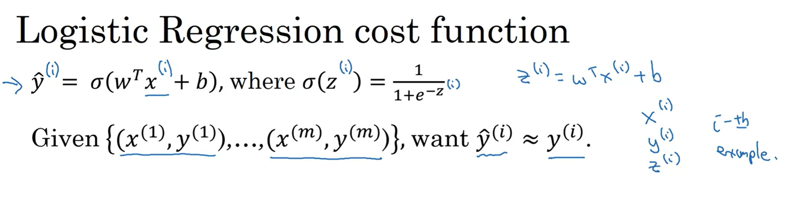

To recap this is what we have defined from the previous slide. 

So, you output $\hat{y}^{(i)} = \sigma(w^Tx^{(i)} + b)$ where $\sigma(z^{(i)}) = \frac{1}{1 + e^{-z^{(i)}}}$ is as defined here. 

So, to learn parameters for your model, you're given a training set of $m$ training examples and it seems natural that you want to find parameters $w$ and $b$ so that at least on the training set, the outputs you have/the predictions you have on the training set, which I will write as $\hat{y}^{(i)}$ that will be close to the ground truth labels $y^{(i)}$ that you got in the training set. 

$$ \hat{y}^{(i)} \approx y^{(i)}
$$

So, to fill in a little bit more detail for the equation on top, we had said that $\hat{y}$ is as defined at the top for a training example $x$ and of course for each training example, we're using these superscripts with round brackets with parentheses to index into different train examples.

Your prediction on a training example $i$ which is $\hat{y}^{(i)}$ is going to be obtained by taking the sigmoid function and applying it to $w^Tx^{(i)} + b$

And you can also define $z^{(i)}$ as follows:

$$
z^{(i)} = w^Tx^{(i)} + b
$$

Throughout this course, we will use the notational convention where the superscript parentheses $(i)$ refer to data associated with the i-th training example, whether it is $x^{(i)}$, $y^{(i)}$ or $z^{(i)}$, or any other value linked to that specific example

### The loss function

Now, let's see what loss function or an error function we can use to measure how well our algorithm is doing.

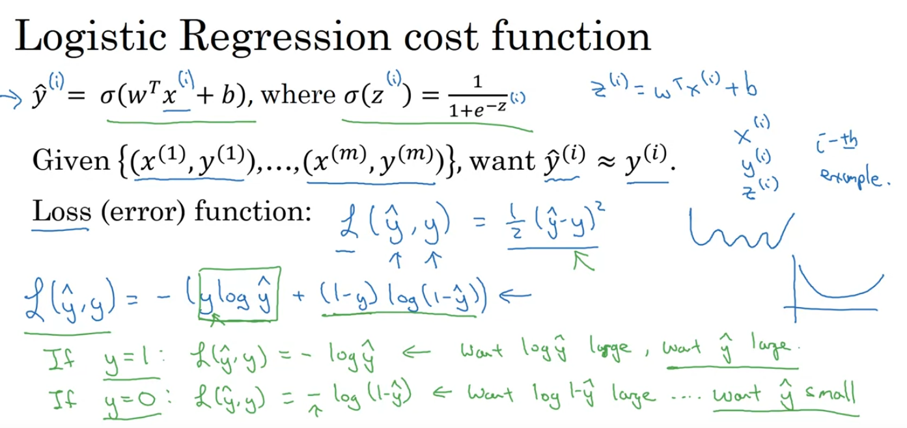

$$
L(\hat{y}, y) = \frac{1}{2} (\hat{y} - y)^2
$$

One thing you could do is define the loss when your algorithm outputs $\hat{y}$ and the true label is $y$ to be maybe the square error or one half a square error. It turns out that you could do this, but in Logistic Regression people don't usually do this because when you come to learn the parameters, you find that the optimization problem, which we'll talk about later becomes non convex so you end up with optimization problem, you're with multiple local optima.

So, Gradient Descent may not find a global optimum. If you didn't understand the last couple of comments, don't worry about it, we'll get to it in a later video.

But the intuition to take away is that this function $L$ called the loss function is a function will need to define to measure how good our output $\hat{y}$ is when the true label is $y$ and squared error seems like it might be a reasonable choice except that it makes Gradient Descent not work well.

So, in Logistic Regression were actually define a different loss function that plays a similar role as squared error but will give us an optimization problem that is convex and so we'll see in a later video becomes much easier to optimize

So, what we use in Logistic Regression is actually the following loss function:

$$
L(\hat{y}, y) = - [ y * log(\hat{y}) + (1-y) * log(1-\hat{y}) ]
$$

Here's some intuition on why this loss function makes sense: Keep in mind that if were using squared error then you want to square error to be as small as possible and with this Logistic Regression loss function will also want this to be as small as possible.

To understand why this makes sense, let's look at the two cases.

#### 1st case: $y = 1$

In the first case let's say $y=1$, then the loss function becomes

$$
L(\hat{y}, y) = -log(\hat{y})
$$

So, this says if $y=1$, you want negative log $\hat{y}$ to be as small as possible so that means you want log $\hat{y}$ to be large to be as big as possible, and that means you want $\hat{y}$ to be large but because $\hat{y}$ is you know the sigmoid function, it can never be bigger than one so this is saying that if $y=1$, you want, $\hat{y}$ to be as big as possible, but it can't ever be bigger than one.

So saying you want, $\hat{y}$ to be close to one as well

#### 2nd case: $y = 0$

If $y = 0$,

$$
L(\hat{y}, y) = -log(1 - \hat{y})
$$

and so if in your learning procedure you try to make the loss function small what this means is that you want, Log 1 minus $\hat{y}$ to be large and because it's a negative sign there.

And then through a similar piece of reasoning, you can conclude that this loss function is trying to make $\hat{y}$ as small as possible, and again, because $\hat{y}$ has to be between zero and 1, this is saying that if $y=0$, then your loss function will push the parameters to make $\hat{y}$ as close to zero as possible.

Now, there are a lot of functions with roughly this effect that if y is equal to one, try to make $\hat{y}$ large and y is equal to zero or try to make $\hat{y}$ small.

We just gave here in green a somewhat informal justification for this particular loss function. We will provide an optional video later to give a more formal justification for why in Logistic Regression, we like to use the loss function with this particular form.

Finally, the last function was defined with respect to a single training example. It measures how well you're doing on a single training example

### The cost function

I'm now going to define something called the cost function, which measures how well you doing on the entire training set.

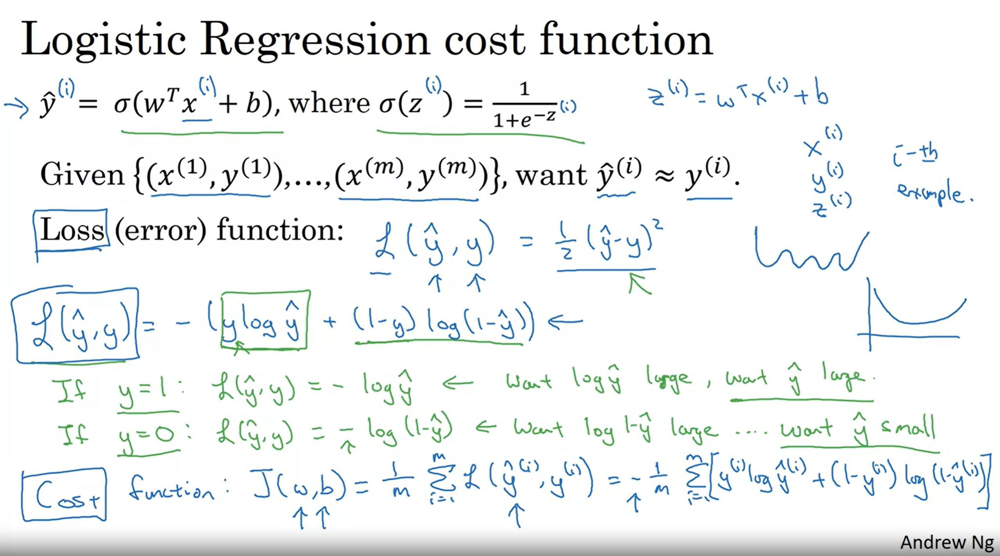

So, the cost function $J$, which is applied to your parameters $w$ and $b$, is going to be the average, really one over $m$ of the sum of the loss function applied to each of the training examples in turn.

$$
J(w, b) = \frac{1}{m} \sum_{i=1}^{m} L(\hat{y}^{(i)}, y^{(i)})
$$

$\hat{y}$ is of course the prediction output by your Logistic Regression algorithm using a particular set of parameters $w$ and $b$.

And so just to expand this out, this is:

$$
J(w, b) = - \frac{1}{m} \sum_{i=1}^{m} [ y^{(i)} * log(\hat{y}^{(i)}) + (1 - y^{(i)}) * log(1 - \hat{y}^{(i)}) ]
$$

So, the minus sign is outside everything else.

So, the terminology I'm going to use is that the loss function is applied to just a single training example and the cost function is the cost of your parameters, so in training your Logistic Regression model, we're going to try to find parameters $w$ and $b$ that minimize the overall cost function $J$

### Summary

So, you've just seen the setup for the Logistic Regression algorithm, the loss function for training example and the overall cost function for the parameters of your algorithm.

It turns out that Logistic Regression can be viewed as a very, very small neural network.

In the next video, we'll go over that so you can start gaining intuition about what neural networks do.

So, with that let's go on to the next video about how to view Logistic Regression as a very small neural network.

Quick question:

What is the difference between the cost function and the loss function for logistic regression?

- [X] The loss function computes the error for a single training example; the cost function is the average of the loss functions of the entire training set. (CORRECT)
- [ ] They are different names for the same function.
- [ ] The cost function computes the error for a single training example; the loss function is the average of the cost functions of the entire training set.

## Gradient Descent

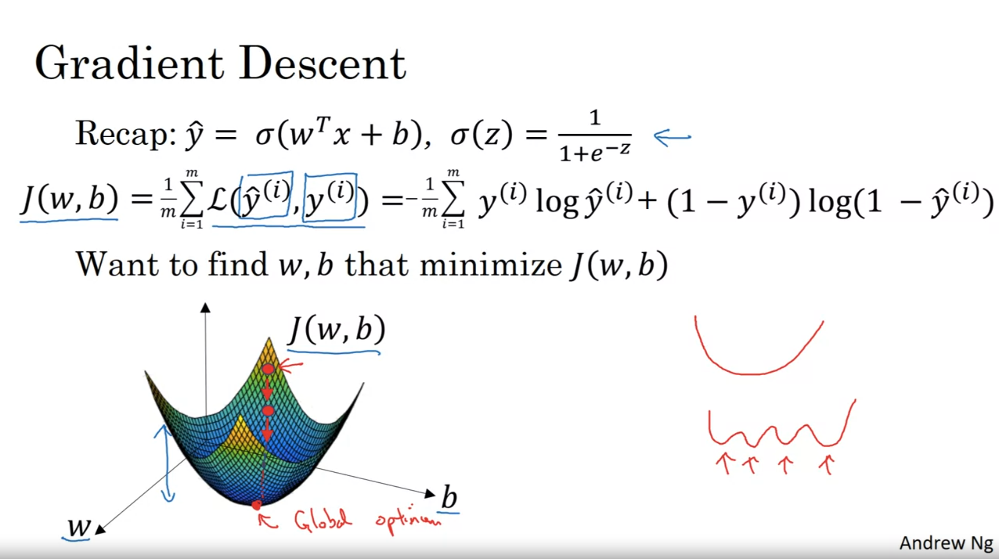

We have seen the logistic regression model, the loss function that measures how well you're doing on a single training example, and the cost function that measures how well your parameters $w$ and $b$ are doing on your entire training set. Now let's talk about how you can use the gradient descent algorithm to train or learn the parameters $w$ in your training set.

To recap, here is the familiar logistic regression algorithm:

$$
\hat{y} = \sigma(w^Tx + b)
$$

And we have on the second line the cost function $J$, which is a function of your parameters $w$ and $b$:

$$
J(w, b) = \frac{1}{m} \sum_{i=1}^{m} L(\hat{y}^{(i)}, y^{(i)})
$$

Where the loss function $L$ measures how well your algorithm's outputs $\hat{y}^{(i)}$ compare to the true labels $y^{(i)}$ on each of the training examples.

The full expanded formula is:

$$
J(w, b) = - \frac{1}{m} \sum_{i=1}^{m} [ y^{(i)} * log(\hat{y}^{(i)}) + (1 - y^{(i)}) * log(1 - \hat{y}^{(i)}) ]
$$

The cost function measures how well your parameters $w$ and $b$ are doing on the training set. To learn a set of parameters $w$ and $b$, it seems natural that we want to find $w$ and $b$ that make the cost function $J(w, b)$ as small as possible.

Here's an illustration of gradient descent. In this diagram, the horizontal axes represent your space of parameters $w$ and $b$. In practice, $w$ can be much higher dimensional, but for illustration purposes, let's represent $w$ as a singular number and $b$ as a singular number.

The cost function $J(w, b)$ is then some surface above these horizontal axes $w$ and $b$. The height of the surface represents the value of $J(w, b)$ at a certain point. What we really want to do is find the value of $w$ and $b$ that corresponds to the minimum of the cost function $J$.

It turns out that this particular cost function $J$ is a convex function. It's just a single big bowl, so this is a convex function, as opposed to functions that look like this, which are non-convex and have lots of different local optima. The fact that our cost function $J(w, b)$ as defined here is convex is one of the huge reasons why we use this particular cost function $J$ for logistic regression.

To find a good value for the parameters, what we'll do is initialize $w$ and $b$ to some initial value, maybe denoted by that little red dot. For logistic regression, almost any initialization method works. Usually, you initialize the values to 0. Random initialization also works, but people don't usually do that for logistic regression. But because this function is convex, no matter where you initialize, you should get to the same point or roughly the same point.

What gradient descent does is it starts at that initial point and then takes a step in the steepest downhill direction. So after one step of gradient descent, you might end up there because it's trying to take a step downhill in the direction of steepest descent or as quickly down as possible. That's one iteration of gradient descent. And after iterations of gradient descent, you might stop there, three iterations and so on, until eventually, hopefully, you converge to this global optimum or get to something close to the global optimum.

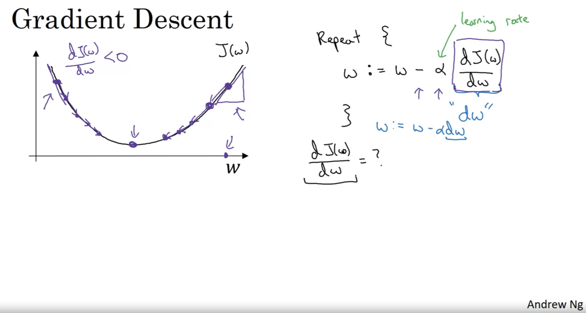

For the purpose of illustration, let's say that there's some function $J(w)$ that you want to minimize and maybe that function looks like this to make this easier to draw. I'm going to ignore $b$ for now just to make this one-dimensional plot instead of a higher-dimensional plot.

Gradient descent does this. We're going to repeatedly carry out the following update:

$$
w := w - \alpha \frac{dJ(w)}{dw}
$$

Where:

- $\alpha$ is the learning rate and controls how big a step we take on each iteration of gradient descent
- $\frac{dJ(w)}{dw}$ is the derivative that represents the slope of the function at the current point

When we start to write code to implement gradient descent, we're going to use the convention that the variable name in our code, $dw$, will be used to represent this derivative term. So when you write code, you write something like:

```math
w := w - \alpha \cdot dw
```

We use $dw$ to be the variable name that represents this derivative term.

Now, let's make sure this gradient descent update makes sense. Let's say that $w$ was over here. So you're at this point on the cost function $J(w)$. Remember that the definition of a derivative is the slope of a function at the point. So the slope of the function is really the height divided by the width of this little triangle here, in this tangent to $J(w)$ at that point.

And so here the derivative is positive. $w$ gets updated as $w$ minus a learning rate times the derivative, the derivative is positive, and so you end up subtracting from $w$. So you end up taking a step to the left and so gradient descent will make your algorithm slowly decrease the parameter.

If you had started off with this large value of $w$. As another example, if $w$ was over here, then at this point the slope here or $\frac{dJ}{dw}$ will be negative. And so the gradient descent update will subtract $\alpha$ times a negative number. And so you end up slowly increasing $w$. So you end up making $w$ bigger and bigger with successive generations of gradient descent.

So hopefully, whether you initialize on the left or right, gradient descent will move you towards this global minimum here.

If you're not familiar with derivatives of calculus and what this term $\frac{dJ(w)}{dw}$ means, don't worry too much about it. We'll talk more about derivatives in the next video. If you have a deep knowledge of calculus, you might be able to have deeper intuitions about how neural networks work. But even if you're not that familiar with calculus, in the next few videos we'll give you enough intuitions about derivatives and about calculus that you'll be able to effectively use neural networks.

But the overall intuition for now is that this term represents the slope of the function and we want to know the slope of the function at the current setting of the parameters so that we can take these steps of steepest descent so that we know what direction to step in to go downhill on the cost function $J$.

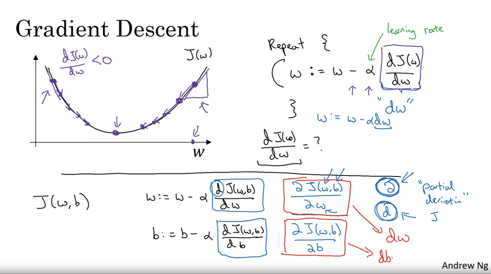

We wrote our gradient descent for $J(w)$. If only $w$ was your parameter in logistic regression, your cost function is a function above $w$ and $b$. In that case, the inner loop of gradient descent, that is this thing here, what you have to repeat becomes as follows:

$$
w := w - \alpha \frac{\partial J(w,b)}{\partial w}
$$

$$
b := b - \alpha \frac{\partial J(w,b)}{\partial b}
$$

These two equations at the bottom are the actual update you implement. On the side, I just want to mention one notation, a convention in calculus that is a bit confusing to some people. I don't think it's super important that you understand calculus, but in case you see this, I want to make sure that you don't think too much of this.

In calculus, this term here we actually write as follows, that funny squiggle symbol $\partial$. This symbol is actually just the lowercase d in a fancy font, in a stylized font. But when you see this expression, all this means is this is the derivative of $J(w,b)$ or really the slope of the function $J(w,b)$, how much that function slopes in the $w$ direction.

And the rule of notation in calculus, which I think is totally illogical, but the rule in the notation for calculus, which I think just makes things much more complicated than they need to be, is that if $J$ is a function of two or more variables, then instead of using lowercase d, you use this funny symbol. This is called a partial derivative symbol, but don't worry about this.

And if $J$ is a function of only one variable, then you use lowercase d. So the only difference between whether you use this funny partial derivative symbol or d minúscula, as we did on top, is whether $J$ is a function of two or more variables, in which case use this symbol, the partial derivative symbol, or $J$ is only a function of one variable, then you use lowercase d.

This is one of those funny rules of notation and calculus that I think just make things more complicated than they need to be. But if you see this partial derivative symbol, all it means is you're measuring the slope of the function with respect to one of the variables.

And similarly, to adhere to the formally correct mathematical notation of calculus, because here $J$ has two inputs, not just one, this thing on the bottom should be written with this partial derivative symbol, but it really means the same thing as, almost the same thing as lowercase d.

Finally, when you implement this in code, we're going to use the convention that this quantity, really the amount you wish to update $w$, will be denoted as the variable $dw$ in your code. And this quantity, the amount by which you want to update $b$, will be denoted by the variable $db$ in your code.

### Summary

Alright. So that's how you can implement gradient descent. Now, if you haven't seen calculus for a few years, I know that that might seem like a lot more derivatives and calculus than you might be comfortable with so far. But if you're feeling that way, don't worry about it. In the next video, we'll give you better intuition about derivatives. And even without the deep mathematical understanding of calculus, with just an intuitive understanding of calculus, you will be able to make your networks work effectively. So let's go into the next video, we'll talk a little bit more about derivatives.

## Derivatives

### Introduction to Derivatives

In this video, I want to help you gain an intuitive understanding of calculus and derivatives. Now, maybe you're thinking that you haven't seen calculus since your college days, and depending on when you graduated, maybe that was quite some time back.

If that's what you're thinking, don't worry. You don't need a deep understanding of calculus in order to apply neural networks and deep learning very effectively. So, if you're watching this video or some of the later videos and you're wondering, "Well, is this stuff really for me? This calculus looks really complicated," my advice to you is the following:

Watch the videos and then if you could do the homeworks and complete the programming homeworks successfully, then you can apply deep learning. In fact, when you see later in week four, we'll define a couple of types of functions that will enable you to encapsulate everything that needs to be done with respect to calculus. These functions, called forward functions and backward functions that you'll learn about, let you put everything you need to know about calculus into these functions, so that you don't need to worry about them anymore beyond that.

But I thought that in this foray into deep learning this week, we should open up the box and peer a little bit further into the details of calculus. But really, all you need is an intuitive understanding of this in order to build and successfully apply these algorithms.

Finally, if you are among that maybe smaller group of people that are expert in calculus, if you are very familiar with calculus derivatives, it's probably okay for you to skip this video. But for everyone else, let's dive in and try to gain an intuitive understanding of derivatives.

### Understanding Derivatives Through Examples

#### Example 1: Linear Function at a = 2

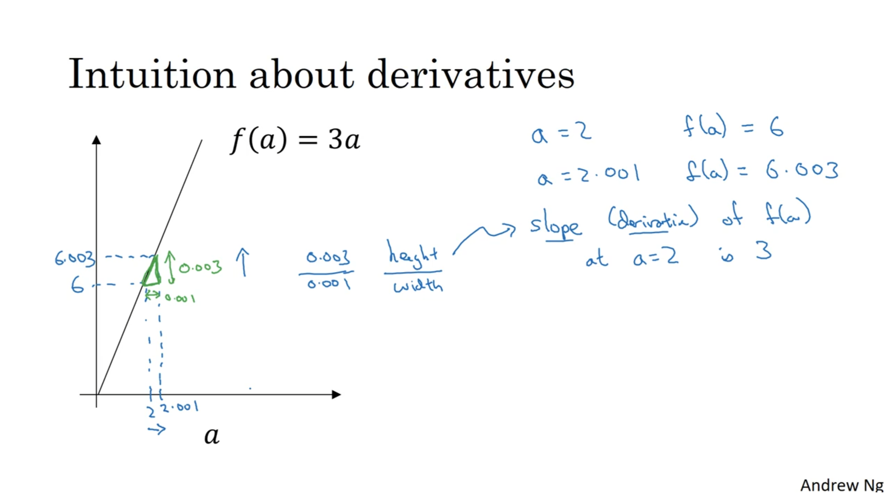

I plotted here the function $f(a) = 3a$. So, it's just a straight line. To get intuition about derivatives, let's look at a few points on this function.

Let's say that $a$ is equal to two. In that case, $f(a)$, which is equal to three times $a$, is equal to six. So, if $a$ is equal to two, then $f(a)$ will be equal to six.

Let's say we give the value of $a$ just a little bit of a nudge. I'm going to just bump up $a$ a little bit, so that it is now 2.001. So, I'm going to give $a$ a tiny little nudge to the right. So now, let's say 2.001, just plot this into scale, 2.001, this 0.001 difference is too small to show on this plot, just give a little nudge to that right.

Now, $f(a)$ is equal to three times that. So, it's 6.003, so we plot this over here. This is not to scale, this is 6.003.

So, if you look at this little triangle here that I'm highlighting in green, what we see is that if I nudge $a$ 0.001 to the right, then $f(a)$ goes up by 0.003. The amount that $f(a)$ went up is three times as big as the amount that I nudged $a$ in the horizontal direction.

So, we're going to say that the slope or the derivative of the function $f(a)$ at $a = 2$ or when $a$ equals two, the slope is three. The term derivative basically means slope, it's just that derivative sounds like a scary and more intimidating word, whereas a slope is a friendlier way to describe the concept of derivative. So, whenever you hear derivative, just think slope of the function.

More formally, the slope is defined as the height divided by the width of this little triangle that we have in green. So, this is 0.003 over 0.001, and the fact that the slope is equal to three or the derivative is equal to three just represents the fact that when you nudge $a$ to the right by 0.001, the amount that $f(a)$ goes up is three times as big as the amount that you nudged $a$ in the horizontal direction. So, that's all that the slope of a line is.

#### Example 2: Linear Function at a = 5

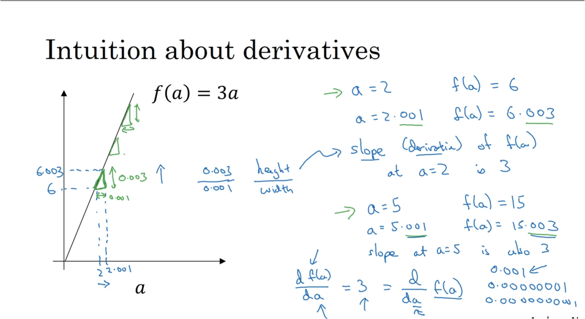

Now, let's look at this function at a different point. Let's say that $a$ is now equal to five. In that case, $f(a)$, three times $a$ is equal to 15. So, let's see that again, give $a$ a nudge to the right. A tiny little nudge, it's now bumped up to 5.001, $f(a)$ is three times that. So, $f(a)$ is equal to 15.003.

So, once again, when I bump $a$ to the right, nudge $a$ to the right by 0.001, $f(a)$ goes up three times as much. So the slope, again, at $a = 5$, is also three.

So, the way we write this, that the slope of the function $f$ is equal to three:

$$
\frac{df(a)}{da} = 3
$$

And this just means, the slope of the function $f(a)$ when you nudge the variable $a$ a tiny little amount, this is equal to three.

An alternative way to write this derivative formula is as follows. You can also write this as:

$$
\frac{d}{da}f(a)
$$

So, whether you put $f(a)$ on top or whether you write it down here, it doesn't matter. But all this equation means is that, if I nudge $a$ to the right a little bit, I expect $f(a)$ to go up by three times as much as I nudged the value of little $a$.

Now, for this video I explained derivatives, talking about what happens if we nudged the variable $a$ by 0.001. If you want a formal mathematical definition of the derivatives: Derivatives are defined with an even smaller value of how much you nudge $a$ to the right. So, it's not 0.001. It's not 0.000001. It's not 0.00000000 and so on 1. It's even smaller than that, and the formal definition of derivative says, whenever you nudge $a$ to the right by an infinitesimal amount, basically an infinitely tiny, tiny amount. If you do that, this $f(a)$ go up three times as much as whatever was the tiny, tiny, tiny amount that you nudged $a$ to the right. So, that's actually the formal definition of a derivative.

But for the purposes of our intuitive understanding, which I'll talk about nudging $a$ to the right by this small amount 0.001. Even if it's 0.001 isn't exactly tiny, tiny infinitesimal.

Now, one property of the derivative is that, no matter where you take the slope of this function, it is equal to three, whether $a$ is equal to two or $a$ is equal to five. The slope of this function is equal to three, meaning that whatever is the value of $a$, if you increase it by 0.001, the value of $f(a)$ goes up by three times as much. So, this function has a safe slope everywhere. One way to see that is that, wherever you draw this little triangle, the height divided by the width always has a ratio of three to one.

### Summary

So, I hope this gives you a sense of what the slope or the derivative of a function means for a straight line, where in this example the slope of the function was three everywhere. In the next video, let's take a look at a slightly more complex example, where the slope to the function can be different at different points on the function.

### Quick Quiz

> **Question:** On a straight line, the function's derivative...
>
> **Options:**
>
> - [X] doesn't change. (CORRECT)
> - [ ] changes as values on axis increase/decrease.

## More Derivative Examples

In this video, I'll show you a slightly more complex example where the slope of the function can be different at different points in the function. Let's start with an example.

### First Example: Quadratic Function

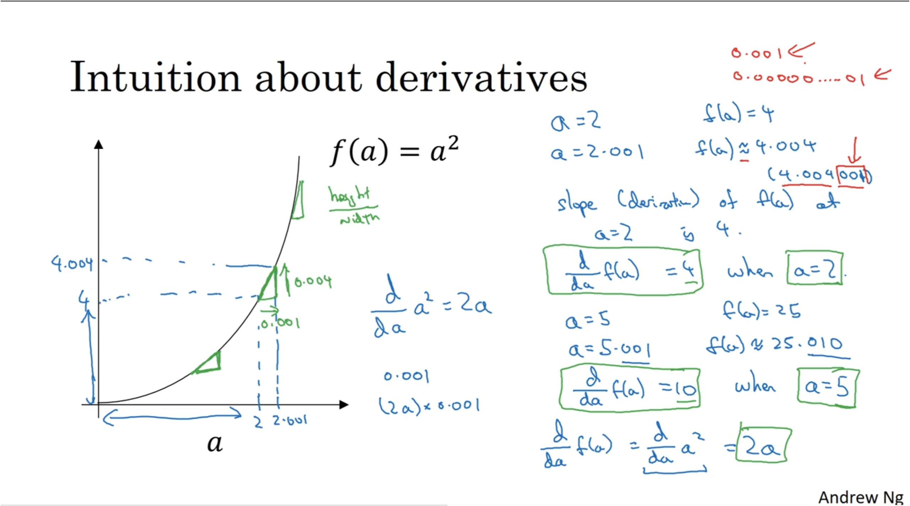

You have plotted the function $f(a) = a^2$. Let's take a look at the point $a = 2$. So $a^2$ or $f(a) = 4$. Let's nudge $a$ slightly to the right, so now $a = 2.001$. $f(a)$ which is $a^2$ is going to be approximately 4.004. It turns out that the exact value, you call the calculator and figured this out is actually 4.004001. I'm just going to say 4.004 is close enough.

So what this means is that when $a = 2$, let's draw this on the plot. So what we're saying is that if $a = 2$, then $f(a) = 4$ and here is the x and y axis are not drawn to scale. Technically, this vertical height should be much higher than this horizontal height so the x and y axis are not on the same scale.

But if I now nudge $a$ to 2.001 then $f(a)$ becomes roughly 4.004. So if we draw this little triangle again, what this means is that if I nudge $a$ to the right by 0.001, $f(a)$ goes up four times as much by 0.004.

So in the language of calculus, we say that a slope that is the derivative of $f(a)$ at $a = 2$ is 4 or to write this out of our calculus notation, we say that:

$$
\frac{d}{da}f(a) = 4 \text{ when } a = 2
$$

Now, one thing about this function $f(a) = a^2$ is that the slope is different for different values of $a$. This is different than the example we saw on the previous slide. So let's look at a different point.

If $a = 5$, so instead of $a = 2$, and now $a = 5$ then $a^2 = 25$, so that's $f(a)$. If I nudge $a$ to the right again, it's tiny little nudge to $a$, so now $a = 5.001$ then $f(a)$ will be approximately 25.010.

So, what we see is that by nudging $a$ up by 0.001, $f(a)$ goes up ten times as much. So we have that:

$$
\frac{d}{da}f(a) = 10 \text{ when } a = 5
$$

because $f(a)$ goes up ten times as much as $a$ does when I make a tiny little nudge to $a$.

So, one way to see why the derivative is different at different points is that if you draw that little triangle right at different locations on this, you'll see that the ratio of the height of the triangle over the width of the triangle is very different at different points on the curve. So here, the slope = 4 when $a = 2$ but $slope = 10$, when $a = 5$.

Now, if you pull up a calculus textbook, a calculus textbook will tell you that $\frac{d}{da}$ of $f(a)$, so $f(a) = a^2$, so that's $\frac{d}{da}$ of $a^2$. One of the formulas you find are the calculus textbook is that this thing, the slope of the function $a^2$, is equal to $2a$.

Not going to prove this, but the way you find this out is that you open up a calculus textbook to the table formulas and they'll tell you that derivative of $a^2$ is $2a$. And indeed, this is consistent with what we've worked out. Namely, when $a = 2$, the slope of function to $a$ is $2 \times 2 = 4$. And when $a = 5$ then the slope of the function $2 \times a$ is $2 \times 5 = 10$.

So, if you ever pull up a calculus textbook and you see this formula, that the derivative of $a^2 = 2a$, all that means is that for any given value of $a$, if you nudge upward by 0.001 already your tiny little value, you will expect $f(a)$ to go up by $2a$, hat is the slope or the derivative, times other much you had nudged to the right the value of $a$.

Now one tiny little detail, I use these approximate symbols here and this wasn't exactly 4.004, there's an extra 0.001 hanging out there. It turns out that this extra 0.001, this little thing here is because we were nudging $a$ to the right by 0.001, if we're instead nudging it to the right by this infinitesimally small value then this extra every term will go away and you find that the amount that $f(a)$ goes out is exactly equal to the derivative times the amount that you nudge $a$ to the right.

And the reason why is not 4.004 exactly is because derivatives are defined using this infinitesimally small nudges to $a$ rather than 0.001 which is not. And while 0.001 is small, it's not infinitesimally small. So that's why the amount that $f(a)$ went up isn't exactly given by the formula but it's only a kind of approximately given by the derivative.

And the reason why is not 4.004 exactly is because derivatives are defined using this infinitesimally small nudges to $a$ rather than 0.001 which is not. And while 0.001 is small, it's not infinitesimally small. So that's why the amount that $f(a)$ went up isn't exactly given by the formula but it's only a kind of approximately given by the derivative.

### Second Example: Cubic and Logarithmic Functions

To wrap up this video, let's just go through a few more quick examples. The example you've already seen is that if $f(a) = a^2$ then the calculus textbooks formula table will tell you that the derivative is equal to $2a$. And so the example we went through was it if $a = 2$, $f(a) = 4$, and we nudge $a$, since it's a little bit bigger than $f(a)$ is about 4.004 and so $f(a)$ went up four times as much and indeed when $a = 2$, the derivatives is equal to 4.

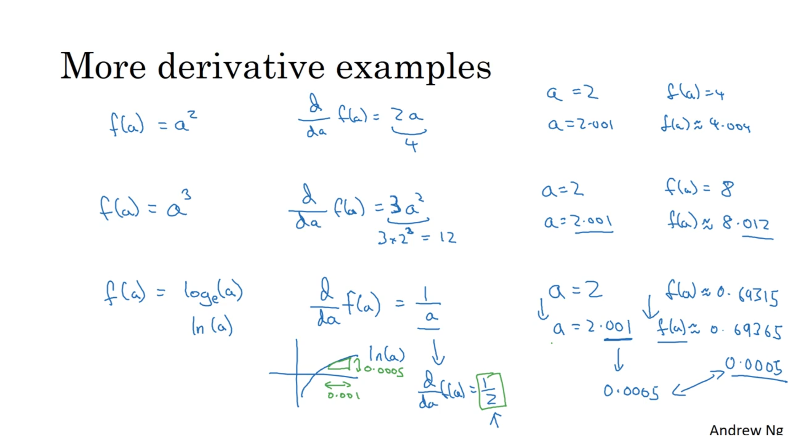

Let's look at some other examples. Let's say, instead the $f(a) = a^3$. If you go to a calculus textbook and look up the table of formulas, you see that the slope of this function, again, the derivative of this function is equal to $3a^2$. So you can get this formula out of the calculus textbook.

So what this means? So the way to interpret this is as follows. Let's take $a = 2$ as an example again. So $f(a)$ or $a^3 = 8$, that's two to the power of three. So we give $a$ a tiny little nudge, you find that $f(a)$ is about 8.012 and feel free to check this. Take 2.001 to the power of three, you find this is very close to 8.012.

And indeed, when $a = 2$ that's $3 \times 2^2$ does equal to $3 \times 4$, you see that's 12. So the derivative formula predicts that if you nudge $a$ to the right by tiny little bit, $f(a)$ should go up 12 times as much. And indeed, this is true when $a$ went up by 0.001, $f(a)$ went up 12 times as much by 0.012.

### One more example: log function

Just one last example and then we'll wrap up. Let's say that $f(a)$ is equal to the log function. So on the right log of $a$, I'm going to use this as the base e logarithm. So some people write that as $\log(a)$. So if you go to calculus textbook, you find that when you take the derivative of $\log(a)$. So this is a function that just looks like that, the slope of this function is given by $\frac{1}{a}$.

So the way to interpret this is that if $a$ has any value then let's just keep using $a = 2$ as an example and you nudge $a$ to the right by 0.001, you would expect $f(a)$ to go up by $\frac{1}{a}$ that is by the derivative times the amount that you increase $a$.

So in fact, if you pull up a calculator, you find that if $a = 2$, $f(a)$ is about 0.69315 and if you increase $f$ and if you increase $a$ to 2.001 then $f(a)$ is about 0.69365, this has gone up by 0.0005.

And indeed, if you look at the formula for the derivative when $a = 2$, $\frac{d}{da}f(a) = \frac{1}{2}$. So this derivative formula predicts that if you pump up $a$ by 0.001, you would expect $f(a)$ to go up by only $\frac{1}{2}$ as much and $\frac{1}{2}$ of 0.001 is 0.0005 which is exactly what we got.

Then when $a$ goes up by 0.001, going from $a = 2$ to $a = 2.001$, $f(a)$ goes up by half as much. So, the answers are going up by approximately 0.0005. So if we draw that little triangle if you will is that if on the horizontal axis just goes up by 0.001 on the vertical axis, $\log(a)$ goes up by half of that so 0.0005. And so that $\frac{1}{a}$ or $\frac{1}{2}$ in this case, $1/a = 2$ that's just the slope of this line when $a = 2$.

### Summary

So that's it for derivatives. There are just two take home messages from this video:

1. The derivative of the function just means the slope of a function and the slope of a function can be different at different points on the function. In our first example where $f(a) = 3a$ those a straight line. The derivative was the same everywhere, it was three everywhere. For other functions like $f(a) = a^2$ or $f(a) = \log(a)$, the slope of the line varies. So, the slope or the derivative can be different at different points on the curve. So that's a first take away. Derivative just means slope of a line.
2. If you want to look up the derivative of a function, you can flip open your calculus textbook or look up Wikipedia and often get a formula for the slope of these functions at different points.

So that, I hope you have an intuitive understanding of derivatives or slopes of lines. Let's go into the next video. We'll start to talk about the computation graph and how to use that to compute derivatives of more complex functions.

## Computation Graph

### Introduction

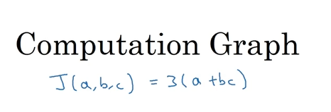

As mentioned earlier, neural network computations are organized in terms of:

1. A **forward pass** or **forward propagation**, where we compute the output of the neural network.
2. A **backward pass** or **backpropagation**, which we use to compute gradients or derivatives.

The computation graph explains why it is organized this way. Let's look at an example to illustrate this.

### Simple Example

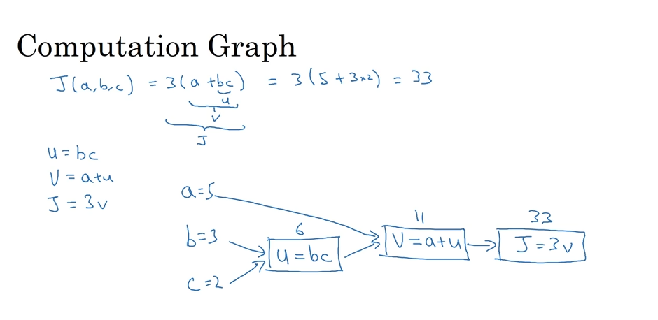

To illustrate the computation graph, we'll use a simpler example than logistic regression or a full neural network. Let's consider a function $J$ that depends on three variables $a$, $b$, and $c$:

$$
J = 3(a + bc)
$$

The computation of this function can be broken down into three distinct steps:

1. First, we compute $u = bc$
2. Then, we compute $v = a + u$
3. Finally, we compute $J = 3v$

### Graphical Representation

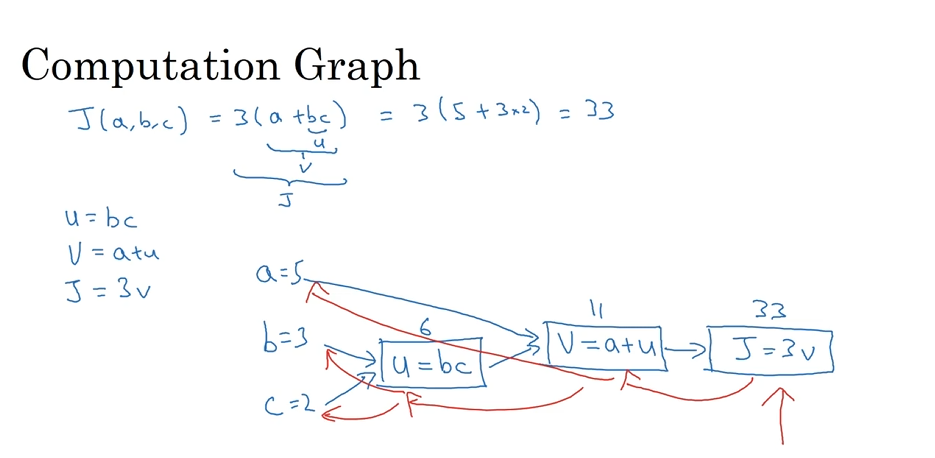

We can represent these three steps in a computation graph as follows:

1. We start with the input variables $a$, $b$, and $c$
2. The first step ($u = bc$) is represented with a rectangle that takes $b$ and $c$ as inputs
3. The second step ($v = a + u$) takes $a$ and $u$ as inputs
4. The final step ($J = 3v$) takes $v$ as input

### Numerical Example

For a concrete example, if:

- $a = 5$
- $b = 3$
- $c = 2$

Then:

1. $u = bc = 3 \times 2 = 6$
2. $v = a + u = 5 + 6 = 11$
3. $J = 3v = 3 \times 11 = 33$

You can verify that this is equivalent to $3(5 + 3 \times 2) = 33$

### Importance of the Computation Graph

The computation graph is particularly useful when there is a distinguished or special output variable, such as $J$ in this case, that we want to optimize. In the case of logistic regression, $J$ is the cost function that we're trying to minimize.

What we see in this example is that:

- Through a left-to-right pass (blue arrows), we can compute the value of $J$
- In the following sections, we'll see how to compute derivatives through a right-to-left pass (red arrows), which is the opposite direction of the blue arrows

### Summary

The computation graph organizes the computation with blue arrows from left to right. In the next video, we'll see how to perform the computation of derivatives with red arrows from right to left.

### Quick Quiz

> **Question:** One step of ________ propagation on a computation graph yields derivative of final output variable.
>
> **Options:**
>
> - [X] Backward (CORRECT)
> - [ ] Forward

## Derivatives with a Computation Graph

## Logistic Regression Gradient Descent

## Gradient Descent on $m$ Examples

## Derivation of DL/dz (Optional)
